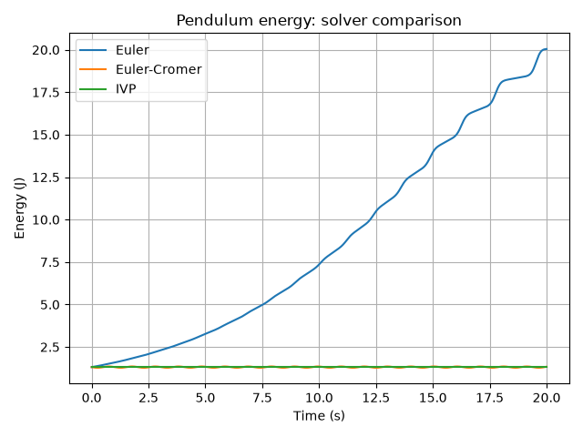
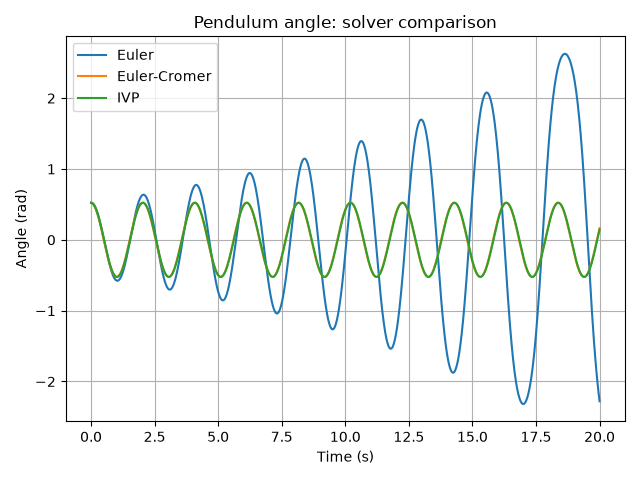
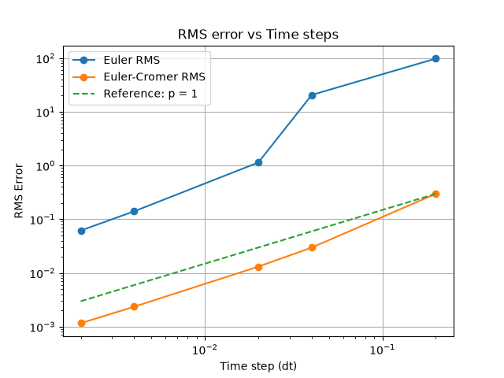

# Numerical Pendulum Simulation

This project simulates a nonlinear pendulum using different numerical integration methods, analysing their accuracy, their energy conservation and their convergence. The project is entirely implemented in Python.

## Physics behind the problem

The nonlinear pendulum is one of the most common problems in classical mechanics, it is as well probably one of the first problems that doesn't have a simple analytical solution. The equation that governs the system is 
$$
\ddot{\theta} = -\frac{g}{L}\sin(\theta) 
$$ 
where $\theta$ is the angular displacement, $g$ is the gravitational acceleration and $L$ is the pendulum length. This equation can be derived by applying Newton's second law in polar coordinates or by using $\theta$ as a generalised coordinate in the Lagrangian formulation, both approaches lead to the same equation of motion. 
This project uses the equation above instead of the small-angle aproximation. Using first-order Taylor's expansion of the sine, the expansion leads to $\sin(\theta)\approx \theta$ making the equation equivalent to the harmonic oscillator. By retaining the $\sin(\theta)$ term the simulation keeps its nonlinear behaviour.

As it is a second-order differential equation we can introduce the angular velocity as a new variable to obtain a system of two first order differential equations as follows:

$$
\dot{\theta} = \omega
$$

$$
\dot{\omega} = -\frac{g}{L}\sin(\theta)

$$

## Numerical Methods and Analysis

### Numerical Methods

This simulation uses three different numerical integration methods: Euler, Euler-Cromer and the SciPy function solve_ivp, which by default uses Runge-Kutta 45. The latter is used as reference rather than an analytical solution, the method itself won't be covered here. The other two use a known state of the system to compute the next one, but although they may look similar the difference in the result is huge. The Euler method uses the slope given by the derivative to compute the next step in both variables. Meanwhile, Euler-Cromer computes the angular velocity first, in this particular case, to then use this new angular velocity to compute the new angle.

### Energy conservation

The physical system has one important property, its mechanical energy is conserved. This means the methods must respect this property as much as possible. This is where the different methods have the bigger differences. The Euler method tends to increase or decrase the energy of the system over time meaning that it doesn't represent the system properly. The Euler-Cromer doesn't conserve the energy either but, it bounds it and oscilates around the correct value. As the oscillations are very small it represents the behaviour of the system much better.



### Convergence

To analyse the convergence of the methods, the simulations were repeated with different time step sizes and each of these simulations were compared against solve_ivp, which was used as a reference. The tolerances of the method were adjusted to make its numerical error sufficiently small, so the measured error came from the method being analysed. After performing the calculations the order of the method was calculated and everything was represented on a logarithmic scale to check for inconsistencies.

### Tests

Basic tests were implemented using `pytest` to verify the correct behaviour of the pendulum model and numerical solvers. The tests check the derivatives, the energy calculation and the output of the Euler and Euler-Cromer methods.

All tests currently pass successfully.

```bash
python -m pytest 
```
## Project Structure

The project is divided into the physical model, numerical solvers and the experiments used to analyse the system.

```text
numerical-pendulum/
├── src/
│   ├── pendulum.py
│   └── solvers.py
├── experiments/
│   ├── test_pendulum.py
│   ├── compare_solvers.py
│   ├── energy.py
│   ├── convergence.py
│   └── animation.py
├── figures/
├── animations/
├── requirements.txt
└── README.md
```

* `src/`: contains the pendulum model and numerical solvers.
* `experiments/`: contains the scripts used to run simulations, analyse the results and test the model.
* `figures/`: stores the generated plots.
* `animations/`: stores the generated animations.
* `requirements.txt`: lists the Python dependencies.

## Installation

Clone the repository and install the required dependencies:

```bash
git clone <repository-url>
cd numerical-pendulum
python -m pip install -r requirements.txt
```

The project was developed using Python 3.14.

## Running the experiments

The different experiments can be run from the project root using the following commands:

```bash
python -m experiments.compare_solvers
python -m experiments.energy
python -m experiments.convergence
python -m experiments.animation
```

The tests can be run with:

```bash
python -m pytest
```

## Results

### Solver comparison

The angle evolution of the three methods is shown below



### Energy conservation

The energy evolution of the system is shown below


The errors and order of the methods is shown below



## Future Improvements

Possible future extensions include adding more numerical integration methods, improving the interactive visualisations and extending the project to more complex pendulum systems.
